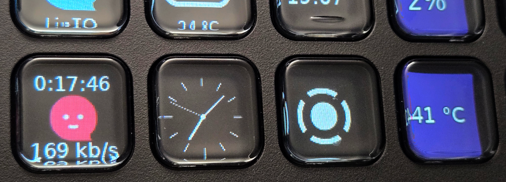

# LinTO plugin for Stream Controller

  

A [StreamController](https://github.com/StreamController/StreamController) plugin
to control the [gnome-linto](https://github.com/benjaminbellamy/gnome-linto) app
from a Stream Deck. It provides one action, **LinTO Toggle**:

- Press to start or pause streaming.
- The button shows the state: Ready / network status when idle, and the elapsed
  time, data sent or bitrate while streaming (configurable).

## Button states

The button always shows one of three icons:

| Ready | Streaming | Problem |
| :---: | :-------: | :-----: |
|  |  |  |
| Ready to stream | Currently streaming | A problem prevents streaming |

## How it works

gnome-linto has a built-in control server. In the app, open the menu and choose
**Stream Controller**, enable the server, and note the port and password (click
the password to copy it). This plugin connects to that server over WebSocket.

## Setup

1. Copy this folder into StreamController's plugins directory.
2. Add the **LinTO Toggle** action to a button.
3. In the action settings, set the **Host** (the machine running gnome-linto),
   **Port** (default 4466), and **Password** shown in the app.

No Python packages are required.

## License

AGPL-3.0-or-later. See [LICENSE](LICENSE).
